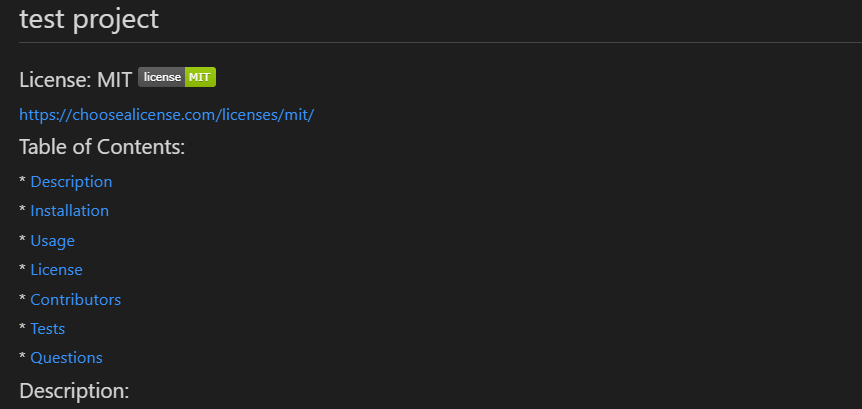

# Node-README-Gen

  ## Description:
  ### This project helps the user create readme docs

  ## Installation:
  ### To install this project, the user must download it from github

  ## Usage:
  ### To use this project, the user must enter the terminal and type node index.js. After answering the prompts, a complete readme file should be generated 
  
  ## final result IMG:
  

  ## Walkthrough video: https://drive.google.com/file/d/18djOG6tLT5ssx0LvaTyegcsAfplNy7Wo/view

